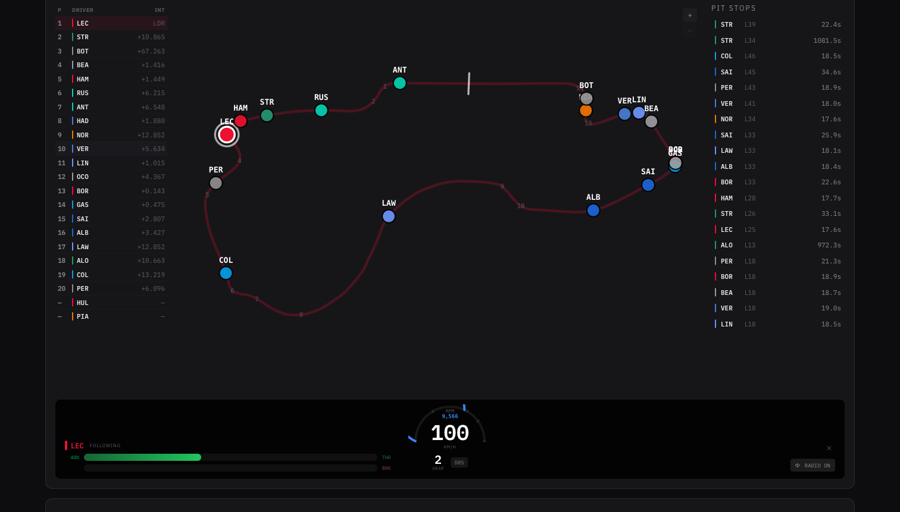

# Grid Watch

An F1 dashboard with live timing, race results, standings, telemetry replay, and analytics. Built with React + FastAPI, deployable as a single Docker container.



## Features

- **Dashboard** — next race countdown, session schedule, weather forecast, driver/constructor standings, latest results, news feed
- **Live timing** — real-time car positions, lap times, gaps, sector data, and team radio during sessions
- **Session replay** — scrub through car positions and telemetry for any downloaded session
- **Lap telemetry comparison** — overlay speed, throttle, brake, RPM, and gear traces for two drivers across a lap
- **Season calendar** — full schedule with session times
- **Analytics** — championship progression charts and points predictions
- **Historical seasons** — browse any season back to 2003

## Running with Docker

```bash
docker compose up
```

The app is available at [http://localhost:8001](http://localhost:8001).

## Running locally

**Backend**

```bash
cd backend
uv sync
uv run uvicorn app.main:app --reload --port 8000
```

**Frontend**

```bash
cd frontend
npm install
npm run dev
```

Frontend dev server runs at `http://localhost:5173` and proxies API requests to the backend.

## Configuration

All config is via environment variables with the `GRIDWATCH_` prefix.

| Variable | Default | Description |
|---|---|---|
| `GRIDWATCH_ADMIN_TOKEN` | _(empty)_ | Bearer token for admin endpoints. Required to enable the admin page. |
| `GRIDWATCH_CORS_ORIGINS` | `http://localhost:5173` | Comma-separated list of allowed CORS origins. |
| `GRIDWATCH_PORT` | `8000` | Port the backend listens on. |
| `GRIDWATCH_LOG_LEVEL` | `info` | Uvicorn log level. |

Example `docker-compose.yml` override:

```yaml
environment:
  - GRIDWATCH_ADMIN_TOKEN=your-secret-token
  - GRIDWATCH_CORS_ORIGINS=https://yourdomain.com
```

## Telemetry data

Detailed telemetry (car positions, speed/throttle/brake traces, team radio) is downloaded on demand from OpenF1 and cached locally in a SQLite database at `/data/f1.db`. Use the Admin page to download sessions — you'll need `GRIDWATCH_ADMIN_TOKEN` set to access it.

## Data sources

- [Jolpica/Ergast](https://api.jolpi.ca) — race results, standings, schedule
- [OpenF1](https://openf1.org) — live timing and telemetry
- [Open-Meteo](https://open-meteo.com) — weather forecasts

## License

MIT
