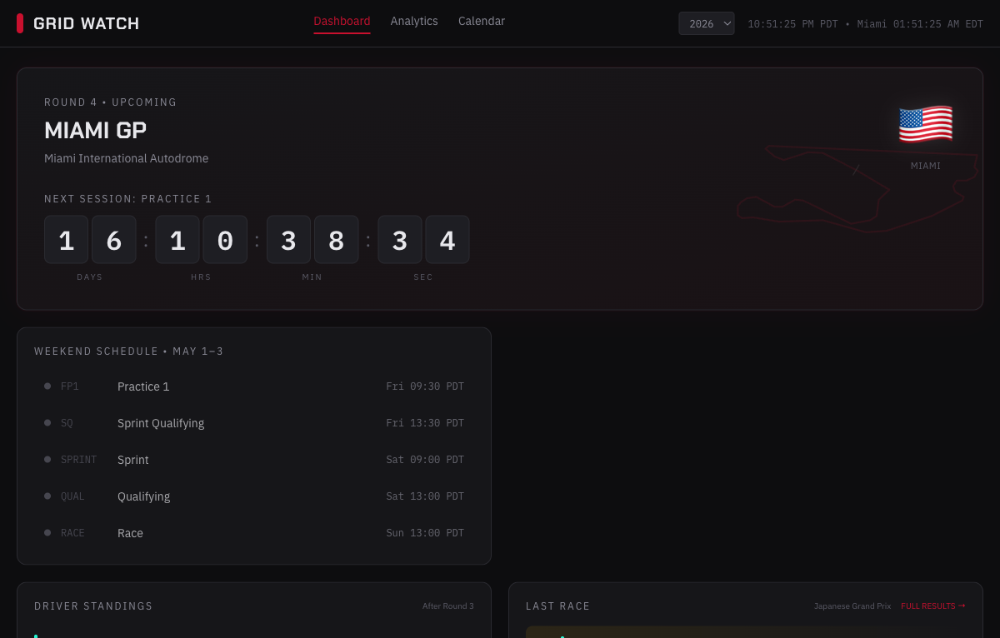

# Grid Watch

An F1 dashboard with live timing, race results, standings, telemetry replay, and analytics. Built with React + FastAPI, deployable as a single Docker container.



## Features

- **Dashboard** — next race countdown, session schedule, weather forecast, driver/constructor standings, latest results, news feed
- **Live timing** — real-time car positions, lap times, gaps, sector data, and team radio during sessions; auto-starts at the current moment with scrub-back for review
- **Session replay** — scrub through any session's car positions, standings, flags, pit stops, and weather
- **Lap telemetry comparison** — overlay speed, throttle, brake, RPM, and gear traces for two drivers across a lap
- **Season calendar** — full schedule with session times
- **Analytics** — championship progression charts and points predictions
- **Historical seasons** — browse any season back to 2023
- **Admin** — per-session data availability dashboard (replay, laps, radio)

## Running with Docker

```bash
docker compose up
```

The app is available at [http://localhost:8001](http://localhost:8001).

## Running locally

**Backend**

```bash
cd backend
uv sync
uv run uvicorn app.main:app --reload --port 8000
```

**Frontend**

```bash
cd frontend
npm install
npm run dev
```

Frontend dev server runs at `http://localhost:5173` and proxies API requests to the backend.

## Configuration

All config is via environment variables with the `GRIDWATCH_` prefix.

| Variable | Default | Description |
|---|---|---|
| `GRIDWATCH_OPENF1_BASE_URL` | `https://api.openf1.org/v1` | Primary OpenF1 API endpoint. Set to a local OpenF1 instance for no rate limits. |
| `GRIDWATCH_OPENF1_FALLBACK_URL` | _(empty)_ | Fallback OpenF1 URL used when the primary returns empty results. |
| `GRIDWATCH_MONGO_CONNECTION_STRING` | _(empty)_ | MongoDB connection string for direct bulk queries, bypassing the OpenF1 API's deduplication. |
| `GRIDWATCH_ADMIN_TOKEN` | _(empty)_ | Bearer token for `/api/admin` endpoints. Required to access the admin page. |
| `GRIDWATCH_CORS_ORIGINS` | `http://localhost:5173` | Comma-separated list of allowed CORS origins. |
| `GRIDWATCH_PORT` | `8000` | Port the backend listens on. |
| `GRIDWATCH_LOG_LEVEL` | `info` | Uvicorn log level. |

## Data

Timing, telemetry, and position data comes from [OpenF1](https://openf1.org). For production, a local OpenF1 instance reads directly from F1's live timing feed and stores data in MongoDB — eliminating rate limits and keeping all historical data local. The `backend/scripts/gap_fill.py` script imports historical sessions from openf1.org into local MongoDB.

When `GRIDWATCH_MONGO_CONNECTION_STRING` is set, the backend queries MongoDB directly for bulk session data (bypassing the OpenF1 API's document deduplication). Results fall back to the OpenF1 API transparently.

## Data sources

- [Jolpica/Ergast](https://api.jolpi.ca) — race results, standings, schedule
- [OpenF1](https://openf1.org) — live timing and telemetry (local instance preferred, openf1.org as fallback)
- [Open-Meteo](https://open-meteo.com) — weather forecasts

## Testing

**Backend** (pytest)

```bash
cd backend
uv run --extra dev python -m pytest
```

**Frontend** (Vitest)

```bash
cd frontend
npm test
```

Backend tests cover the cache, HTTP clients, facade business logic (session key lookup, replay event processing, live detection, standings, pit grouping), circuit geometry, MongoDB queries, and router endpoints. Frontend tests cover utility functions, the countdown hook, and the replay controls component.

## License

MIT
